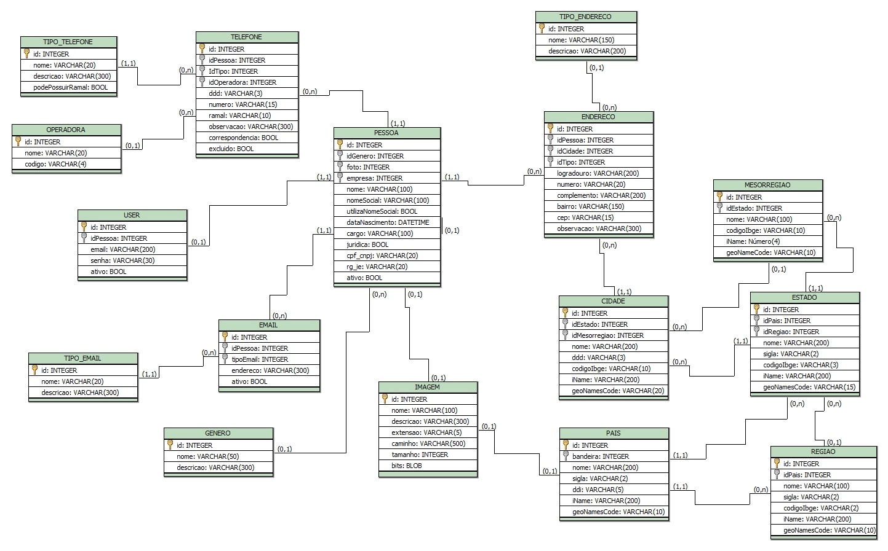

## Cadastro de contatos

Consiste em um CRUD simples de empresas e contatos, com endereços e telefones, desenvolvido em Laravel 6.

## Requisitos básicos

O contato deve ser composto por {
    Empresa,
    Nome,
    Data/hora de cadastro,
    Data/hora de alteração,
    Telefones, de quantidade variável
}

A empresa deverá ser compostar por {
    Nome,
    CPF ou CNPJ,
    Município
}

Três regras de negócio definem o comportamento básico do "sistema":
- Pessoa física necessita cadastrar RG e data de nascimento;
- Pessoa jurídica precisa possuir Nome Fantasia;
- A listegem de contatos deve conter filtros por Nome e CPF/CNPJ.

Desejável que seja oferecido a listagem de clientes por API REST.

## Proposta de solução

Buscando oferecer a funcionalidade de um módulo de cadastro básico, foi desenvolvido um plano inicial, ilustrado pelo diagrama abaixo:

Neles está previsto a implementação de armazenamento de informações sobre pessoas físicas e jurídicas, com endereços, telefones, endereços de correspondência eletrônica, foto de perfil ou logotipo e usuário para autenticação.

Não foi implementado a persistência de e-mails, imagens e usuários, permanecendo com seus recursos de forma pública.

O código carece de muita refatoração, para se adequar à tecnologias mais atuais de conduta de front-end. 

## Requisitos de instalação

Para rodar esta aplicação você vai precisar ter instalado:
- <a href="https://getcomposer.org/download/">Composer</a> v1.9+
- <a href="https://nodejs.org/en/download/">NodeJS</a> v10+
- <a href="https://www.php.net/downloads">PHP</a> v7.2+
- <a href="https://mariadb.com/kb/en/getting-installing-and-upgrading-mariadb/">MariaDB</a>

Opcionalmente:
- Servidor Web local. Por exemplo: <a href="https://www.apachefriends.org/pt_br/index.html">Xampp v7+</a> (Apache + PHP v7.2+ + MariaDB)

Para executar:
- Descompactar o conteúdo do arquivo de códigos na pasta do servidor web, se estiver usando um
- Criar um banco de dados vazio no MariaDB, com o nome de "contatos"
- Entrar pelo console na pasta do projeto
- Executar o comando: composer install
- Executar o comando: npm install
- Executar o comando: "php artisan migrate --seed"
- se não tiver um servidor web, execute o comando: php artisan serve
- a aplicação estará disponível em http://127.0.0.1:8000
- se estiver utilizando o servidor web, acesse com o navegador a pasta do projeto (http://localhost/.../contatos/public)

## License

The Laravel framework is open-source software licensed under the [MIT license](https://opensource.org/licenses/MIT).
